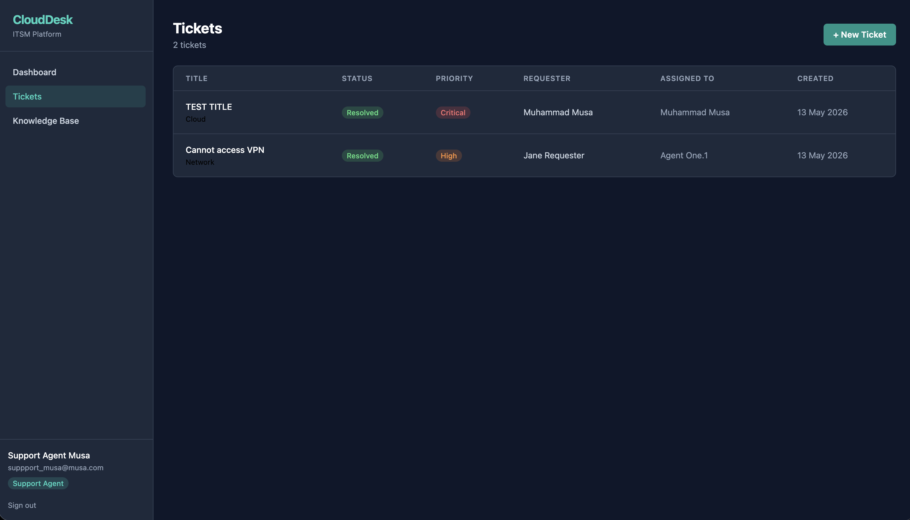
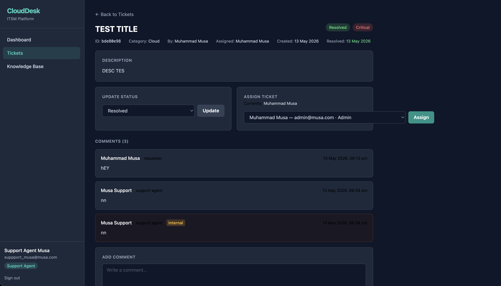
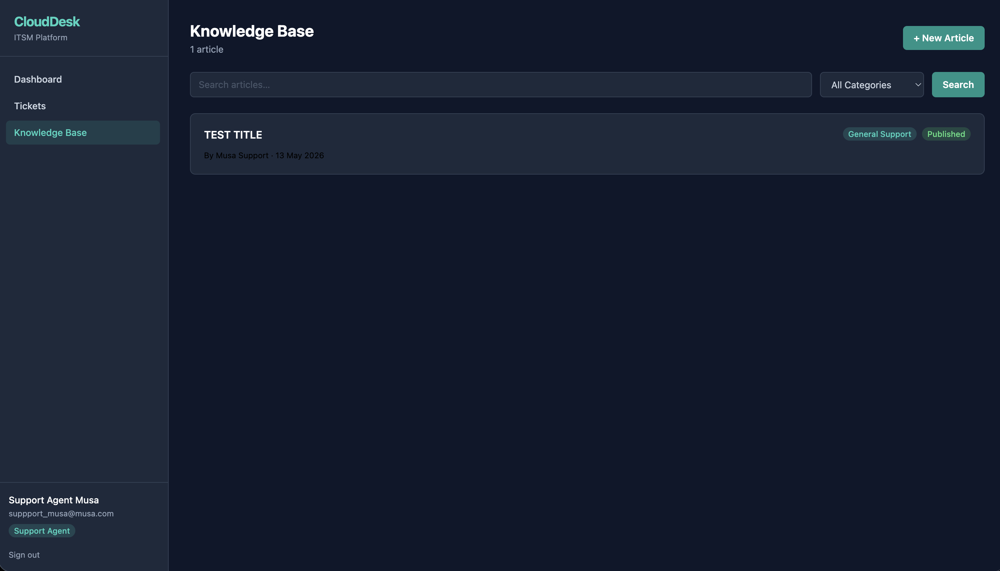
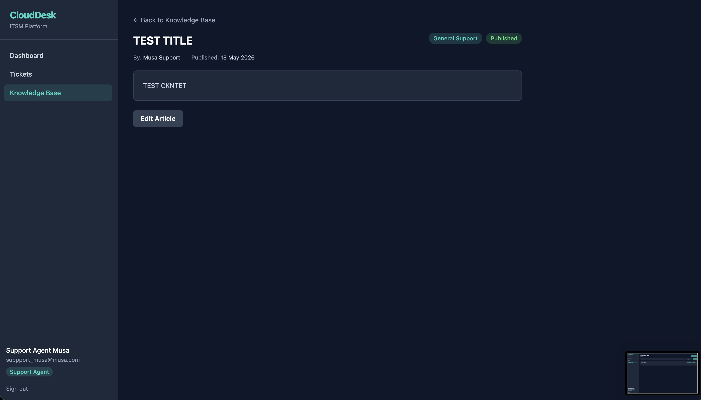

# CloudDesk ITSM Platform

A full-stack IT Service Management platform built to demonstrate end-to-end IT support workflows — from ticket submission and triage through to escalation, resolution, and knowledge base management.


---

## Why I Built This

ITSM tools like ServiceNow sit at the centre of enterprise IT support, but most developer portfolios demonstrate code skills without IT operations context — and most IT support CVs demonstrate operations knowledge without technical depth. CloudDesk bridges that gap.

The goal was to build something that an Australian IT hiring manager could look at and recognise: this person understands how a service desk actually works, and they can build the software that runs it.

---

## Employer-Facing Value

| What it demonstrates | How |
|---|---|
| IT support workflow understanding | Ticket lifecycle enforced in code: New → Assigned → In Progress → Escalated → Resolved → Closed |
| Triage and escalation thinking | Priority and category fields, status transitions, assignment workflow |
| Incident and request handling | Separate comment types (public vs. internal notes), resolution timestamps |
| Knowledge base management | Article publishing workflow with draft/publish states |
| Authentication and authorisation | JWT, bcryptjs, RBAC enforced at API level — not just the UI |
| Backend API design | RESTful Express API with consistent error handling and populated Mongoose documents |
| Application support thinking | Dashboard metrics scoped to role, structured error responses, clean audit trail |
| Cloud deployment readiness | Architecture designed for Stage 2 AWS deployment (EC2, MongoDB Atlas, S3) |

---

## Key Features

- **JWT Authentication** — Secure register/login with 7-day token expiry, password hashed with bcrypt
- **Three-Role RBAC** — `requester`, `support_agent`, and `admin` roles enforced at every API endpoint
- **Full Ticket Lifecycle** — New → Assigned → In Progress → Escalated → Resolved → Closed, with `resolvedAt` timestamp
- **Ticket Assignment** — Agents and admins can assign tickets via a populated assignee dropdown
- **Comments** — Public comments visible to all; internal notes visible only to agents and admins
- **Knowledge Base** — Agents create, edit, and publish articles; requesters browse and search published content
- **KB Search** — Search by title, content, category, and tags via dedicated search endpoint
- **Dashboard Metrics** — Ticket counts, status/priority/category breakdowns, and recent tickets — scoped by role
- **Seed Script** — One-command demo user creation for local testing

---

## Tech Stack

| Layer | Technology |
|---|---|
| Frontend | React 18, Vite, TypeScript, Tailwind CSS |
| Backend | Node.js 20, Express 4, TypeScript |
| Database | MongoDB, Mongoose 8 |
| Auth | JWT (jsonwebtoken), bcryptjs |
| HTTP Client | Axios |
| Dev Tools | ts-node-dev, ESLint |

---

## Architecture Overview

```
┌─────────────────────────────┐
│   Browser — React SPA       │
│   (Vite dev server :5173)   │
└────────────┬────────────────┘
             │ /api/* (proxied in dev)
             ▼
┌─────────────────────────────┐
│   Express REST API :5000    │
│   authMiddleware → RBAC     │
│   routes → controllers      │
└────────────┬────────────────┘
             │ Mongoose ODM
             ▼
┌─────────────────────────────┐
│   MongoDB                   │
│   Users · Tickets · KB      │
└─────────────────────────────┘
```

See [docs/architecture.md](docs/architecture.md) for the full architecture document.

---

## User Roles

| Role | Permissions |
|---|---|
| `requester` | Register, login, create tickets, view own tickets, comment on own tickets, read published KB articles |
| `support_agent` | View all tickets, update status, assign tickets, add internal notes, create/edit KB articles |
| `admin` | All agent permissions + delete KB articles |

---

## Demo Credentials (Local Only)

> These credentials are for local portfolio demonstration only. Do not use in production.

| Role | Email | Password |
|---|---|---|
| Requester | requester@clouddesk.dev | Password123! |
| Support Agent | agent@clouddesk.dev | Password123! |
| Admin | admin@clouddesk.dev | Password123! |

---

## Local Setup

### Prerequisites

- Node.js 20+
- MongoDB running locally, or a MongoDB Atlas connection string

### 1. Clone the repository

```bash
git clone https://github.com/musahx/clouddesk-itsm.git
cd clouddesk-itsm
```

### 2. Configure the server environment

```bash
cd server
npm install
cp .env.example .env
```

Edit `server/.env`:

```
PORT=5000
MONGO_URI=mongodb://localhost:27017/clouddesk
JWT_SECRET=your-secret-key-change-this
```

### 3. Start the server

```bash
npm run dev
```

Server runs on `http://localhost:5000`.

### 4. Seed demo users

```bash
npm run seed
```

Creates the three demo users if they do not already exist. Safe to re-run.

### 5. Start the client

Open a new terminal:

```bash
cd client
npm install
npm run dev
```

Client runs on `http://localhost:5173`. All `/api` requests proxy to the server automatically — no CORS configuration needed in development.

### 6. Verify

```bash
curl http://localhost:5000/api/health
# → {"status":"ok","service":"CloudDesk API"}
```

Then open `http://localhost:5173` and log in with any demo credential.

---

## Environment Variables

| Variable | Required | Description |
|---|---|---|
| `PORT` | No | API server port (default: 5000) |
| `MONGO_URI` | Yes | MongoDB connection string |
| `JWT_SECRET` | Yes | Secret used to sign JWT tokens — keep this strong and private |

See `server/.env.example` for the template.

---

## API Overview

Base URL: `http://localhost:5000/api`

| Method | Endpoint | Description | Auth |
|---|---|---|---|
| POST | `/auth/register` | Register new user | Public |
| POST | `/auth/login` | Login, returns JWT | Public |
| GET | `/users/assignees` | List agents and admins | Agent/Admin |
| GET | `/tickets` | List tickets (scoped by role) | Any |
| POST | `/tickets` | Create a ticket | Any |
| GET | `/tickets/:id` | Get ticket detail | Any |
| PATCH | `/tickets/:id/status` | Update ticket status | Agent/Admin |
| POST | `/tickets/:id/comments` | Add comment | Any |
| PATCH | `/tickets/:id/assign` | Assign ticket | Agent/Admin |
| GET | `/kb` | List KB articles | Any |
| GET | `/kb/search` | Search KB articles | Any |
| GET | `/kb/:id` | Get article detail | Any |
| POST | `/kb` | Create article | Agent/Admin |
| PATCH | `/kb/:id` | Update article | Agent/Admin |
| DELETE | `/kb/:id` | Delete article | Admin |
| GET | `/dashboard` | Dashboard metrics | Any |

Full request/response documentation: [docs/api.md](docs/api.md)

---

## Screenshots

> To add screenshots: run the app locally, capture each screen, and save to the `screenshots/` folder.
> See [screenshots/README.md](screenshots/README.md) for the full capture checklist and filenames.

| Screen | Preview |
|---|---|
| Dashboard |  |
| Ticket List |  |
| Ticket Detail |  |
| Knowledge Base |  |
| Knowledge Article |  |

---

## Stage 1 Scope

Stage 1 is a fully functional local MVP. It includes:

- [x] Project scaffold (monorepo, TypeScript, Tailwind)
- [x] Backend authentication (register, login, JWT, bcrypt)
- [x] Backend tickets (CRUD, status, comments, assignment)
- [x] Backend knowledge base (articles, search, publish/draft)
- [x] Backend dashboard (metrics, role-scoped aggregation)
- [x] Frontend authentication (login, register, protected routes, AuthContext)
- [x] Frontend tickets (list, detail, create, status update, assign, comment)
- [x] Frontend knowledge base (list, search, detail, create, edit, delete)
- [x] Frontend dashboard (metric cards, breakdowns, recent tickets)
- [x] Seed script (demo users)
- [x] Documentation (README, architecture, API reference, case study, roadmap)

Stage 1 deliberately excludes AWS deployment, Docker, CI/CD, S3, CloudWatch, and ServiceNow integration. These are covered in the future roadmap.

---

## Documentation

| Document | Description |
|---|---|
| [Architecture](docs/architecture.md) | System design, auth flow, RBAC, data models, folder structure |
| [API Reference](docs/api.md) | Full endpoint documentation with request/response examples |
| [Stage 1 Case Study](docs/stage-1-case-study.md) | Project write-up for portfolio review |
| [Future Roadmap](docs/future-roadmap.md) | Stage 2–4 plans including AWS, monitoring, and ServiceNow mapping |

---

## Future Roadmap

- **Stage 2** — AWS deployment (EC2/ECS, MongoDB Atlas, S3, IAM, Route 53)
- **Stage 3** — Observability (CloudWatch, health checks, error tracking, SLA alerting)
- **Stage 4** — ServiceNow workflow mapping, SLA rules, escalation matrix, email notifications

See [docs/future-roadmap.md](docs/future-roadmap.md) for detail.

---

## Licence

MIT — built for portfolio use.
